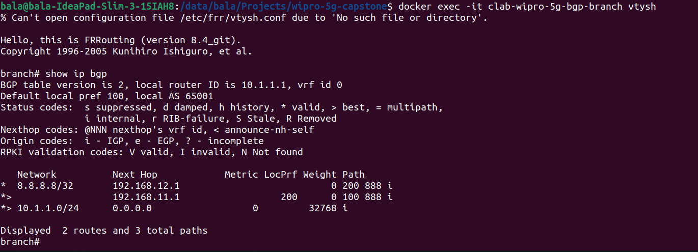
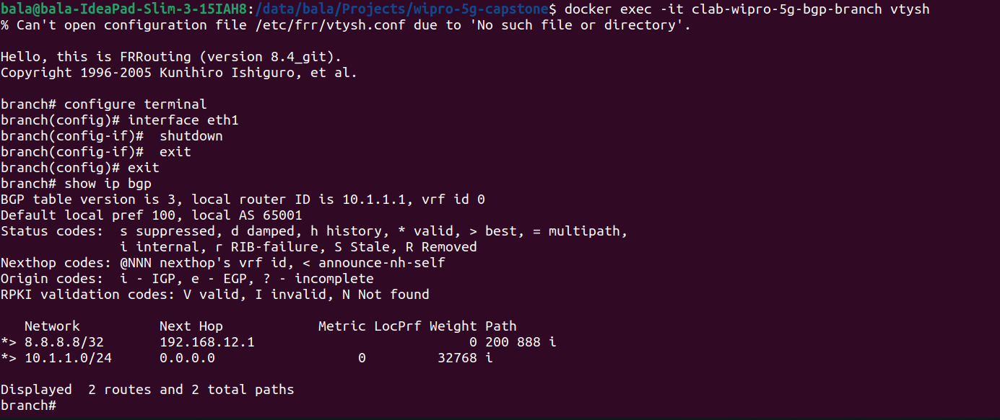
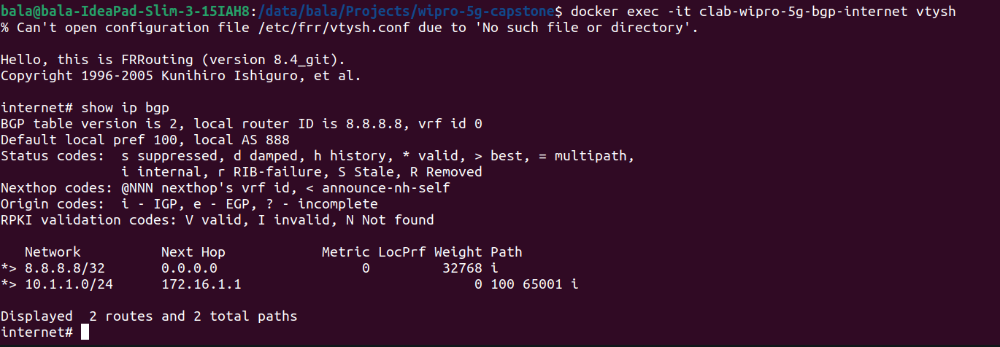
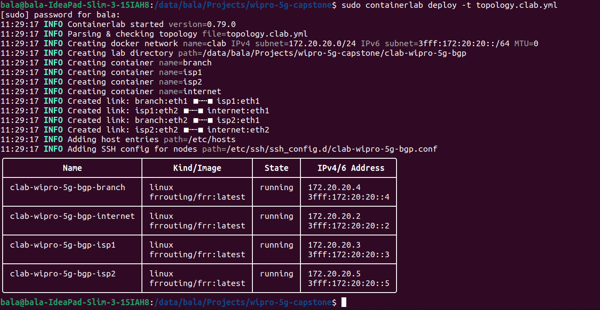

#  eBGP branch-to-ISP peering with route filtering and AS-path traffic Steering

**Slot 8 — eBGP branch-to-ISP peering with route filtering and AS-path traffic steering**

## The result seen from the branch

After the lab was running, the first useful check was simply the BGP table on the branch router:

```text
show ip bgp
```

For the Internet prefix `8.8.8.8/32`, the branch selected ISP 1 through `192.168.11.1`. The reason was the higher Local Preference applied to routes received from ISP 1.

The important part of the output was:

```text
*> 8.8.8.8/32    192.168.11.1    0 200 888 i
```

The `*>` marker showed the selected best path, and the `200` value showed the Local Preference applied to that route.



This was the outbound direction of the traffic-steering test.

---

## When the primary link was removed

The primary branch-to-ISP 1 connection was `eth1`. Instead of only checking the configuration, I tested what happened when that link was actually taken out of service.

From the branch router:

```text
branch# configure terminal
branch(config)# interface eth1
branch(config-if)# shutdown
```

The BGP table was checked again after the interface was shut down. The selected route changed to the other provider:

```text
*> 8.8.8.8/32    192.168.12.1
```

So the path through ISP 2 (`192.168.12.1`) became active after the ISP 1 path disappeared. This is the failover behaviour demonstrated in the lab.



The separate `Failover-report.md` document contains the detailed failover evidence and explanation.

---

## What the project was required to solve

**Problem Statement**

Multi-homed branches must steer traffic and filter routes. Build eBGP and manipulate path selection.

The project objectives were to configure eBGP peering from a branch to two ISPs, advertise and filter prefixes with route-maps, apply AS-path prepending and Local Preference, verify inbound and outbound path selection, and validate failover.

**Technology Stack:** FRRouting, Containerlab, Wireshark.

**Type:** Implementation

**Deliverables:** BGP configurations, path-selection demo, failover report.

---

## A small route-map made the outbound decision

The branch was connected to two providers, so both could potentially provide a route to the Internet prefix. To make ISP 1 the preferred outbound path, I used Local Preference on routes received from that neighbor.

```text
route-map RM_IN_ISP1 permit 10
 set local-preference 200
```

It was applied to the ISP 1 BGP neighbor:

```text
neighbor 192.168.11.1 route-map RM_IN_ISP1 in
```

This did not change the route itself. It changed how the branch ranked the available paths. The higher Local Preference made the ISP 1 path the preferred route.

---

## The return path was handled differently

For traffic coming from the Internet towards the branch network `10.1.1.0/24`, Local Preference on the branch would not control the remote router's decision. For that direction, AS-path prepending was used.

The branch advertised its own prefix to ISP 2 with its AS number repeated three times:

```text
route-map RM_OUT_ISP2 permit 10
 match ip address prefix-list BRANCH_NET
 set as-path prepend 65001 65001 65001
```

The policy was applied towards ISP 2:

```text
neighbor 192.168.12.1 route-map RM_OUT_ISP2 out
```

The result could then be observed from the Internet router. The Internet node saw the path through ISP 2 with the additional AS entries, so the path through ISP 1 was preferred.



This gave the required inbound path-selection demonstration without changing the branch prefix itself.

---

## The branch prefix was explicitly matched

The branch network used in the lab was:

```text
10.1.1.0/24
```

To make sure the branch advertised its own network rather than becoming an unintended transit path between ISP 1 and ISP 2, a prefix-list was used:

```text
ip prefix-list BRANCH_NET seq 5 permit 10.1.1.0/24
```

The normal outbound route-map matched this list:

```text
route-map RM_OUT permit 10
 match ip address prefix-list BRANCH_NET
```

The same prefix-list was also used by the ISP 2 policy before the AS-path was modified.

The idea was simple: match the branch's own prefix, advertise that prefix, and do not use the branch as a path for unrelated routes.

---

## The lab itself was built as four FRRouting nodes

Containerlab was used to create the virtual network, with Docker containers running FRRouting.

The topology contained:

```text
branch
isp1
isp2
internet
```

The main BGP AS relationships were:

```text
Branch    AS 65001
ISP 1     AS 100
ISP 2     AS 200
Internet  AS 888
```

The branch side used:

```text
eth1 -> 192.168.11.2/30 -> ISP 1
eth2 -> 192.168.12.2/30 -> ISP 2
lo   -> 10.1.1.1/24
```

ISP 1 used `192.168.11.1` towards the branch, while ISP 2 used `192.168.12.1`.

The Internet router originated:

```text
8.8.8.8/32
```

The deployment itself was started with:

```bash
sudo containerlab deploy -t topology.clab.yml
```



---

## The BGP peering on the branch

The branch configuration contains the two external BGP neighbours:

```text
router bgp 65001
 bgp router-id 10.1.1.1
 neighbor 192.168.11.1 remote-as 100
 neighbor 192.168.12.1 remote-as 200
```

The branch advertises:

```text
address-family ipv4 unicast
 network 10.1.1.0/24
```

The policy bindings used on those neighbours were:

```text
neighbor 192.168.11.1 route-map RM_IN_ISP1 in
neighbor 192.168.11.1 route-map RM_OUT out
neighbor 192.168.12.1 route-map RM_IN in
neighbor 192.168.12.1 route-map RM_OUT_ISP2 out
```

That is where the two different traffic-steering controls were connected to the actual eBGP sessions.

---

## Looking at the Internet side

The Internet router was placed in AS `888` and peered with both providers:

```text
router bgp 888
 bgp router-id 8.8.8.8
 neighbor 172.16.1.1 remote-as 100
 neighbor 172.16.2.1 remote-as 200
```

It originated the test destination:

```text
address-family ipv4 unicast
 network 8.8.8.8/32
```

This gave the branch something real to choose between for outbound testing, while the branch prefix `10.1.1.0/24` gave the Internet router something to choose between for inbound testing.

---

## How the path-selection test was checked

The main verification command used during the work was:

```text
show ip bgp
```

On the branch, the Internet prefix was checked to confirm the Local Preference decision.

On the Internet router, the branch prefix was checked to confirm the AS-path decision.

The two checks were useful because they showed different BGP controls working in opposite directions:

```text
Branch -> Internet
Local Preference
ISP 1 preferred

Internet -> Branch
AS-path prepending
ISP 1 preferred
```

The screenshots stored in `docs/` are the terminal evidence for these checks.

---

The `daemons` files were used to enable the required FRRouting services, and the `frr.conf` files contain the node-specific BGP and route-map configuration.

---


## Deliverables represented in this repository

The required project outputs are kept as separate, readable pieces rather than putting every detail into one file.

**BGP configurations**

Available under `configs/`, including the branch, ISP 1, ISP 2 and Internet FRRouting configurations.

**Failover report**

`Failover-report.pdf` documents the `eth1` shutdown test and the change of the active path to ISP 2.

**Output evidence**

The `images/` directory contains the deployment and BGP verification screenshots.

---

## What was observed during the failover test

Before the outage:

```text
8.8.8.8/32 -> 192.168.11.1
```

After `eth1` was shut down:

```text
8.8.8.8/32 -> 192.168.12.1
```

The change was visible directly in the BGP table through the `*>` best-path marker. The test therefore demonstrated that the second eBGP connection was not only configured but was actually usable as the backup path.

---

## FRRouting runtime note

While opening `vtysh`, FRRouting printed:

```text
% Can't open configuration file /etc/frr/vtysh.conf due to 'No such file or directory'.
```

The `vtysh` shell still started and the BGP tables were available for verification. The warning did not prevent the path-selection and failover tests shown in the project evidence.

---

## References

- Containerlab Documentation — https://containerlab.dev/
- FRRouting Documentation — https://docs.frrouting.org/
- Wireshark Documentation — https://www.wireshark.org/docs/
- RFC 4271: A Border Gateway Protocol 4 (BGP-4) — https://www.rfc-editor.org/rfc/rfc4271
